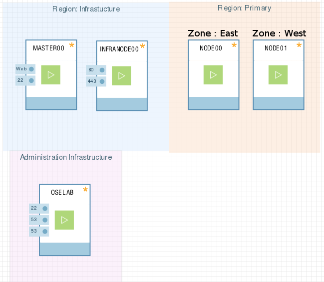

:toc: macro

= OpenShift 3.1 Demonstration

toc::[]

= Demonstration Tracks and Snippets

In this demonstration guide we provide multiple "Demo Snippets". +
_Demo Snippets_ are short demonstrations that can run independently from each
other. +

When demonstrating any technology, its important to put the demonstrations into
context, we gathered snippets into *Tracks* as a suggestion but you can mix and
match snippets according to your audience.

You can create any demo with this fully functional environment, please feel free
 to email me your snippet [sborenst@redhat.com]

=== Developer's Day Demonstration Scenario (the David track)

* *Goal* - Demonstrate OpenShift Enterprise's ability to simplify and streamline
rapid application development.
* *Audience* - This is a technical demonstration intended for technical
resources, but you can present it at different depths.
* Consider your audience's areas of interest and select the most appropriate
demo snippets:
- Snippet - link:Snippet_DeployPrebuiltImage/DemoSnippet.adoc[Deploy Application
 from a Docker Image and scale.] (command line)
- Snippet - link:Snippet_DeployS2I/DemoSnippet.adoc[Deploy Application
 from Git repository Using S2I Build and scale.] (web console)
- Snippet -  link:Snippet_DeployTemplate_2tier/DemoSnippet.adoc[Deploy a
two-tiered application from a template] (web console and command line)

=== Operation Team's Day Demonstration Scenario (the Karla track)

NOTE: *Under Construction and not available atm*

* *Goal* - Demonstrate OpenShift Enterprise's ability to reduce the complexity
of application deployment and management.
* *Audience* - This is a technical demonstration intended for technical
resources, but you can present it at different depths.
* Consider your audience's areas of interest and select the most appropriate
demo snippets:
- Snippet - Demonstrate application scaling (command line)
- Snippet - Demonstrate application update and rollback

= Environment Setup

This Demonstration is designed to work with the *Red Hat Product Demo System*
(link:https://rhpds.redhat.com[]). +

NOTE: It is assumed that you have OPENTLC credentials to access the *RHPDS*
environment, and that have completed the _OpenShift FASTRAX training_.

Follow the instructions in the
link:Demonstration.Environment.Setup.adoc[Demonstration Environment Setup]
Page to provision and configure your environment.

When you provision your environment you will receive an email from OPENTLC with
the connection details of your environment (IPs and hostnames *not passwords*).

= Environment Overview

Our environment is designed to demonstrate a highly scalable PaaS architecture.
We created a 2 layer topology based on Regions and Zones.

Our *master00* host will be used to host some of the management components of
OpenShift Enterprise, Components such as the Web Console, *The API service* and
the *etcd store*.

*Infranode* is a regular node like the others but by changing the labels applied
to the node we are going to dedicate it to be used only for "Infrastructure
containers". This is a design choice and not a mandatory constraint.

the *nodes*, nodes are hosts that are used to run containers (Pods) in the OSE
environment, we label the two nodes to be in the same region but different
zones. This is to simulate a use-case of an environment in a single region and
possibly two cloud availability zones.

= Get Started

To get started, you need to:

* Deploy your environment by following the instructions in the
link:Demonstration.Environment.Setup.adoc[Demonstration Environment Setup] page.
- Allow about 30 minutes for provisioning and auto installation and about 5
minutes for running the demo deployment script.
* Read the _Legend_ and demonstration tips in the
link:Additional.Information.adoc[additional information] page.
* Pick a snippet from the available snippet list:
- Snippet - link:Snippet_DeployPrebuiltImage/DemoSnippet.adoc[Deploy Application
 from a Docker Image and scale.] (command line)
- Snippet - link:Snippet_DeployS2I/DemoSnippet.adoc[Deploy Application
 from Git repository Using S2I Build and scale.] (web console)
- Snippet -  link:Snippet_DeployTemplate_2tier/DemoSnippet.adoc[Deploy a
two-tiered application from a template] (web console and command line)
